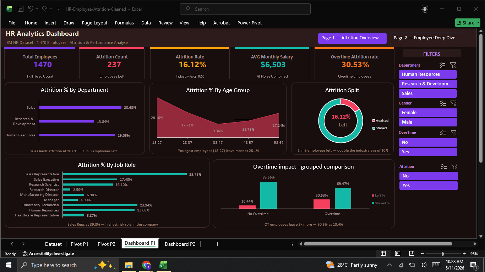
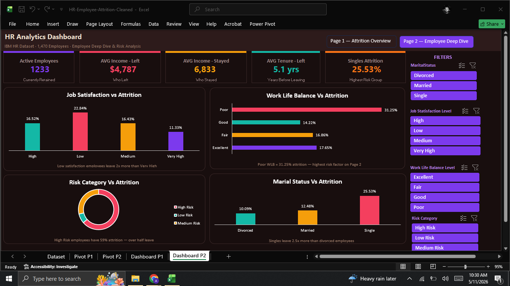

# IBM HR Analytics Dashboard

Interactive HR Analytics Dashboard built in Microsoft Excel using IBM HR Attrition Dataset.

## Overview
- **Dataset:** IBM HR Attrition | 1,470 employees | 32 columns
- **Tool:** Microsoft Excel + VBA
- **Pages:** 2 (Attrition Overview + Employee Deep Dive)
- **Theme:** Custom Dark Coffee

## Dashboard Features
- 10 KPI Cards with live GETPIVOTDATA formulas
- 9 Interactive Charts
- 8 Dynamic Slicers
- VBA Navigation Buttons between pages
- Custom slicer style matching dark theme

## Key Findings
- Overall attrition rate: **16.12%** (industry avg: 10%)
- Overtime employees leave **3x more** than non-OT staff
- Sales Representatives: **39.76%** attrition — highest risk role
- Single employees leave **2.5x more** than married
- High Risk employees: **59% attrition rate**
- Poor Work-Life Balance = **31.25% attrition**

## Recommendations
- Cap overtime for Sales Reps and Lab Technicians
- Launch retention program for single employees under 30
- Quarterly manager check-ins for High Risk flagged employees
- Review Sales Rep compensation urgently

## Tools Used
Excel | Pivot Tables | GETPIVOTDATA | VBA | Custom Slicer Styles

## Author
**Ali Zaib** | [GitHub](https://github.com/zaib-analyst)

## Dashboard Preview

### Page 1 — Attrition Overview

### Page 2 — Employee Deep Dive

